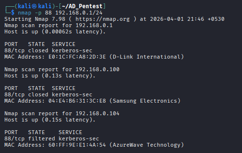
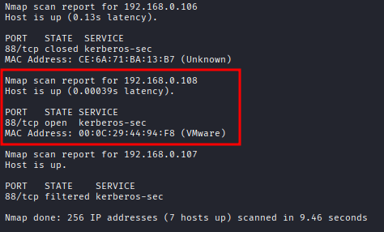

# 1.2 Initial Enumeration

Let's start our initial enumeration.

## Network Scanning:

```bash
## 1. Check host IP:
ifconfig
```

<figure><figcaption></figcaption></figure>

```bash
## 2. Network Scan with nmap:
nmap -sn <IP/mask> --exclude <host_IP>
```

<figure><figcaption></figcaption></figure>

```bash
## Scan for open port:
nmap -p 88 <IP>
## here we can use port 88 which is used by kerberos.
```

<figure><figcaption></figcaption></figure>

<figure><figcaption></figcaption></figure>

We see that the "88" port is open on the "192.168.0.108" IP, means that is our terget DC.

We can also use NXC tool to find our terget:

```bash
## 4. Network Scan with NXE:
nxe smb <IP/mask>
```

<figure><figcaption></figcaption></figure>

In the result of nxc, we can get smb and domain information. That means we successfully identify our terget.

***

## Vulnerability Scan:

```bash
1. Vulnerability Scan with rustscan:
rustscan -a <TARGET_IP>
```

> Note: We can also use '--' on rustscan command to use nmap scripts/functions like, example:
>
> ```
> rustscan -a <TARGET_IP> -- -Pn -sV 
> ```

<figure><figcaption></figcaption></figure>

<figure><figcaption></figcaption></figure>

Download and install rustscan from [here](https://github.com/bee-san/RustScan). Download the .deb file.

```bash
## Install Rustscan:
unzip rustscan.deb.zip
sudo dpkg -i rustscan_*_amd64.deb
```

<figure><figcaption></figcaption></figure>

```bash
2. Vulnerability Scan with nmap:
nmap -p- -T4 -vv 192.168.0.108 -Pn -A -sC -sV -oN DC_Nmap.txt
```

```bash
## Nmap Scan Result:
Host discovery disabled (-Pn). All addresses will be marked 'up' and scan times may be slower.
Starting Nmap 7.98 ( https://nmap.org ) at 2026-04-01 22:09 +0530
NSE: Loaded 158 scripts for scanning.
NSE: Script Pre-scanning.
NSE: Starting runlevel 1 (of 3) scan.
Initiating NSE at 22:09
Completed NSE at 22:09, 0.00s elapsed
NSE: Starting runlevel 2 (of 3) scan.
Initiating NSE at 22:09
Completed NSE at 22:09, 0.00s elapsed
NSE: Starting runlevel 3 (of 3) scan.
Initiating NSE at 22:09
Completed NSE at 22:09, 0.00s elapsed
Initiating ARP Ping Scan at 22:09
Scanning 192.168.0.108 [1 port]
Completed ARP Ping Scan at 22:09, 0.04s elapsed (1 total hosts)
Initiating Parallel DNS resolution of 1 host. at 22:09
Completed Parallel DNS resolution of 1 host. at 22:09, 0.50s elapsed
Initiating SYN Stealth Scan at 22:09
Scanning 192.168.0.108 [65535 ports]
Discovered open port 139/tcp on 192.168.0.108
Discovered open port 135/tcp on 192.168.0.108
Discovered open port 80/tcp on 192.168.0.108
Discovered open port 53/tcp on 192.168.0.108
Discovered open port 445/tcp on 192.168.0.108
Discovered open port 389/tcp on 192.168.0.108
Discovered open port 5357/tcp on 192.168.0.108
Discovered open port 636/tcp on 192.168.0.108
Discovered open port 49680/tcp on 192.168.0.108
Discovered open port 49665/tcp on 192.168.0.108
Discovered open port 56501/tcp on 192.168.0.108
Discovered open port 49666/tcp on 192.168.0.108
Discovered open port 56488/tcp on 192.168.0.108
Discovered open port 49667/tcp on 192.168.0.108
Discovered open port 5985/tcp on 192.168.0.108
Discovered open port 593/tcp on 192.168.0.108
Discovered open port 56471/tcp on 192.168.0.108
Discovered open port 49679/tcp on 192.168.0.108
Discovered open port 49672/tcp on 192.168.0.108
Discovered open port 47001/tcp on 192.168.0.108
Discovered open port 464/tcp on 192.168.0.108
Discovered open port 9389/tcp on 192.168.0.108
Discovered open port 49664/tcp on 192.168.0.108
Discovered open port 3269/tcp on 192.168.0.108
Discovered open port 49683/tcp on 192.168.0.108
Discovered open port 49668/tcp on 192.168.0.108
Discovered open port 3268/tcp on 192.168.0.108
Discovered open port 88/tcp on 192.168.0.108
Completed SYN Stealth Scan at 22:09, 34.90s elapsed (65535 total ports)
Initiating Service scan at 22:09
Scanning 28 services on 192.168.0.108
Completed Service scan at 22:10, 53.61s elapsed (28 services on 1 host)
Initiating OS detection (try #1) against 192.168.0.108
NSE: Script scanning 192.168.0.108.
NSE: Starting runlevel 1 (of 3) scan.
Initiating NSE at 22:10
Completed NSE at 22:10, 8.72s elapsed
NSE: Starting runlevel 2 (of 3) scan.
Initiating NSE at 22:10
Completed NSE at 22:10, 0.09s elapsed
NSE: Starting runlevel 3 (of 3) scan.
Initiating NSE at 22:10
Completed NSE at 22:10, 0.00s elapsed
Nmap scan report for 192.168.0.108
Host is up, received arp-response (0.0013s latency).
Scanned at 2026-04-01 22:09:21 IST for 98s
Not shown: 65507 closed tcp ports (reset)
PORT      STATE SERVICE       REASON          VERSION
53/tcp    open  domain        syn-ack ttl 128 Simple DNS Plus
80/tcp    open  http          syn-ack ttl 128 Microsoft IIS httpd 10.0
|_http-title: IIS Windows Server
| http-methods: 
|   Supported Methods: OPTIONS TRACE GET HEAD POST
|_  Potentially risky methods: TRACE
|_http-server-header: Microsoft-IIS/10.0
88/tcp    open  kerberos-sec  syn-ack ttl 128 Microsoft Windows Kerberos (server time: 2026-04-01 16:40:04Z)
135/tcp   open  msrpc         syn-ack ttl 128 Microsoft Windows RPC
139/tcp   open  netbios-ssn   syn-ack ttl 128 Microsoft Windows netbios-ssn
389/tcp   open  ldap          syn-ack ttl 128 Microsoft Windows Active Directory LDAP (Domain: external.local, Site: Default-First-Site-Name)
|_ssl-date: 2026-04-01T16:41:01+00:00; +2s from scanner time.
| ssl-cert: Subject: 
| Subject Alternative Name: DNS:DC02.external.local, DNS:external.local, DNS:EXTERNAL
| Issuer: commonName=external-DC02-CA/domainComponent=external
| Public Key type: rsa
| Public Key bits: 2048
| Signature Algorithm: sha256WithRSAEncryption
| Not valid before: 2026-03-03T14:37:54
| Not valid after:  2027-03-03T14:37:54
| MD5:     dec2 4a61 5569 1c9e 8edd 3a8b 7bb0 5a07
| SHA-1:   83ce 6fb8 c938 04d9 aaac 1f93 fe86 472a 302d 83f0
| SHA-256: 772d 664e 18a4 1dd6 4724 0a8f 909f 15f4 147b 098c 7907 4c24 bf67 4e7e a3fb 84c4
| -----BEGIN CERTIFICATE-----
| MIIFtDCCBJygAwIBAgITSgAAAAN3/xyeRseYTwAAAAAAAzANBgkqhkiG9w0BAQsF
| ADBMMRUwEwYKCZImiZPyLGQBGRYFbG9jYWwxGDAWBgoJkiaJk/IsZAEZFghleHRl
| cm5hbDEZMBcGA1UEAxMQZXh0ZXJuYWwtREMwMi1DQTAeFw0yNjAzMDMxNDM3NTRa
| Fw0yNzAzMDMxNDM3NTRaMAAwggEiMA0GCSqGSIb3DQEBAQUAA4IBDwAwggEKAoIB
| AQDKp6bjZU00W89przrk2vUMGH3xEdoroa7bydUfIQGfhRQ3G024DkTXj5l27IK9
| 9PFynv00c+ed3TOhddMpEUxQTWnKQC2y0U/tQ6LmSCIUoOBDj2DfoMH9MBvlguBU
| Z4xjQoJxN7IT6OwFHmIpAE2f5+eycRJZOjFuSrTr+B5XhHl+SEEh53M7Lyg9T7NH
| ijhXClnOMC+gQSuu+y85ZDSPcBY/KYFQWNbem5MZ6DiG+7Mkrv0eqezZDI1gHzBV
| ZMCfbzJoOj8R+2x6ef0oEqVlzzPAmJqcCnUCi0KAqHJNHXNd/cLxehkQX+hSbhkt
| WqvLLdhfLRRbv7MVBcswFN1JAgMBAAGjggLZMIIC1TA3BgkrBgEEAYI3FQcEKjAo
| BiArBgEEAYI3FQip6hyG5IdZh8mNJIGZ4HaDwvISgVABIQIBbgIBADAyBgNVHSUE
| KzApBggrBgEFBQcDAgYIKwYBBQUHAwEGCisGAQQBgjcUAgIGBysGAQUCAwUwDgYD
| VR0PAQH/BAQDAgWgMEAGCSsGAQQBgjcVCgQzMDEwCgYIKwYBBQUHAwIwCgYIKwYB
| BQUHAwEwDAYKKwYBBAGCNxQCAjAJBgcrBgEFAgMFMB0GA1UdDgQWBBQn1mjOdnK0
| GzXlXUfwZdL9ulpi5zAfBgNVHSMEGDAWgBQDj6hSEGKRTSfViYfpYM0aTtvBGzCB
| zgYDVR0fBIHGMIHDMIHAoIG9oIG6hoG3bGRhcDovLy9DTj1leHRlcm5hbC1EQzAy
| LUNBLENOPURDMDIsQ049Q0RQLENOPVB1YmxpYyUyMEtleSUyMFNlcnZpY2VzLENO
| PVNlcnZpY2VzLENOPUNvbmZpZ3VyYXRpb24sREM9ZXh0ZXJuYWwsREM9bG9jYWw/
| Y2VydGlmaWNhdGVSZXZvY2F0aW9uTGlzdD9iYXNlP29iamVjdENsYXNzPWNSTERp
| c3RyaWJ1dGlvblBvaW50MIHFBggrBgEFBQcBAQSBuDCBtTCBsgYIKwYBBQUHMAKG
| gaVsZGFwOi8vL0NOPWV4dGVybmFsLURDMDItQ0EsQ049QUlBLENOPVB1YmxpYyUy
| MEtleSUyMFNlcnZpY2VzLENOPVNlcnZpY2VzLENOPUNvbmZpZ3VyYXRpb24sREM9
| ZXh0ZXJuYWwsREM9bG9jYWw/Y0FDZXJ0aWZpY2F0ZT9iYXNlP29iamVjdENsYXNz
| PWNlcnRpZmljYXRpb25BdXRob3JpdHkwOwYDVR0RAQH/BDEwL4ITREMwMi5leHRl
| cm5hbC5sb2NhbIIOZXh0ZXJuYWwubG9jYWyCCEVYVEVSTkFMMA0GCSqGSIb3DQEB
| CwUAA4IBAQB6yt4+1YZVm7VwSRwTXbYPm9dfWlcBRnq6SqPCvMntynlIxGN/gRwj
| wYi2qwVPDpZ2qUntnHbJiF4xebngdOhB3SfOEibwIygSQ6lbOMbyZFbERY1QCqMT
| 6X73elCJcyZOknlE3BJsbb0dX6WXkcJ0xL5SQHnLbAJ3Ebcpaz1omXpaTfCy8QSb
| NdIpdPiOWfsWJdOfr8Bf2sabauu3BQz80RuNMxJiz7XJW6OFlgeEeWNGSp49YHyF
| q5NPUIXdKMN/5SpR2ix/VDJ7fSBiDa8isWW4mouHq3VpH3YA99HzYNf3squZKucw
| yZFfOFfopnY1oKq1Lq0OJ1nT3TeXQg9b
|_-----END CERTIFICATE-----
445/tcp   open  microsoft-ds? syn-ack ttl 128
464/tcp   open  kpasswd5?     syn-ack ttl 128
593/tcp   open  ncacn_http    syn-ack ttl 128 Microsoft Windows RPC over HTTP 1.0
636/tcp   open  ssl/ldap      syn-ack ttl 128 Microsoft Windows Active Directory LDAP (Domain: external.local, Site: Default-First-Site-Name)
|_ssl-date: 2026-04-01T16:41:01+00:00; +2s from scanner time.
| ssl-cert: Subject: 
| Subject Alternative Name: DNS:DC02.external.local, DNS:external.local, DNS:EXTERNAL
| Issuer: commonName=external-DC02-CA/domainComponent=external
| Public Key type: rsa
| Public Key bits: 2048
| Signature Algorithm: sha256WithRSAEncryption
| Not valid before: 2026-03-03T14:37:54
| Not valid after:  2027-03-03T14:37:54
| MD5:     dec2 4a61 5569 1c9e 8edd 3a8b 7bb0 5a07
| SHA-1:   83ce 6fb8 c938 04d9 aaac 1f93 fe86 472a 302d 83f0
| SHA-256: 772d 664e 18a4 1dd6 4724 0a8f 909f 15f4 147b 098c 7907 4c24 bf67 4e7e a3fb 84c4
| -----BEGIN CERTIFICATE-----
| MIIFtDCCBJygAwIBAgITSgAAAAN3/xyeRseYTwAAAAAAAzANBgkqhkiG9w0BAQsF
| ADBMMRUwEwYKCZImiZPyLGQBGRYFbG9jYWwxGDAWBgoJkiaJk/IsZAEZFghleHRl
| cm5hbDEZMBcGA1UEAxMQZXh0ZXJuYWwtREMwMi1DQTAeFw0yNjAzMDMxNDM3NTRa
| Fw0yNzAzMDMxNDM3NTRaMAAwggEiMA0GCSqGSIb3DQEBAQUAA4IBDwAwggEKAoIB
| AQDKp6bjZU00W89przrk2vUMGH3xEdoroa7bydUfIQGfhRQ3G024DkTXj5l27IK9
| 9PFynv00c+ed3TOhddMpEUxQTWnKQC2y0U/tQ6LmSCIUoOBDj2DfoMH9MBvlguBU
| Z4xjQoJxN7IT6OwFHmIpAE2f5+eycRJZOjFuSrTr+B5XhHl+SEEh53M7Lyg9T7NH
| ijhXClnOMC+gQSuu+y85ZDSPcBY/KYFQWNbem5MZ6DiG+7Mkrv0eqezZDI1gHzBV
| ZMCfbzJoOj8R+2x6ef0oEqVlzzPAmJqcCnUCi0KAqHJNHXNd/cLxehkQX+hSbhkt
| WqvLLdhfLRRbv7MVBcswFN1JAgMBAAGjggLZMIIC1TA3BgkrBgEEAYI3FQcEKjAo
| BiArBgEEAYI3FQip6hyG5IdZh8mNJIGZ4HaDwvISgVABIQIBbgIBADAyBgNVHSUE
| KzApBggrBgEFBQcDAgYIKwYBBQUHAwEGCisGAQQBgjcUAgIGBysGAQUCAwUwDgYD
| VR0PAQH/BAQDAgWgMEAGCSsGAQQBgjcVCgQzMDEwCgYIKwYBBQUHAwIwCgYIKwYB
| BQUHAwEwDAYKKwYBBAGCNxQCAjAJBgcrBgEFAgMFMB0GA1UdDgQWBBQn1mjOdnK0
| GzXlXUfwZdL9ulpi5zAfBgNVHSMEGDAWgBQDj6hSEGKRTSfViYfpYM0aTtvBGzCB
| zgYDVR0fBIHGMIHDMIHAoIG9oIG6hoG3bGRhcDovLy9DTj1leHRlcm5hbC1EQzAy
| LUNBLENOPURDMDIsQ049Q0RQLENOPVB1YmxpYyUyMEtleSUyMFNlcnZpY2VzLENO
| PVNlcnZpY2VzLENOPUNvbmZpZ3VyYXRpb24sREM9ZXh0ZXJuYWwsREM9bG9jYWw/
| Y2VydGlmaWNhdGVSZXZvY2F0aW9uTGlzdD9iYXNlP29iamVjdENsYXNzPWNSTERp
| c3RyaWJ1dGlvblBvaW50MIHFBggrBgEFBQcBAQSBuDCBtTCBsgYIKwYBBQUHMAKG
| gaVsZGFwOi8vL0NOPWV4dGVybmFsLURDMDItQ0EsQ049QUlBLENOPVB1YmxpYyUy
| MEtleSUyMFNlcnZpY2VzLENOPVNlcnZpY2VzLENOPUNvbmZpZ3VyYXRpb24sREM9
| ZXh0ZXJuYWwsREM9bG9jYWw/Y0FDZXJ0aWZpY2F0ZT9iYXNlP29iamVjdENsYXNz
| PWNlcnRpZmljYXRpb25BdXRob3JpdHkwOwYDVR0RAQH/BDEwL4ITREMwMi5leHRl
| cm5hbC5sb2NhbIIOZXh0ZXJuYWwubG9jYWyCCEVYVEVSTkFMMA0GCSqGSIb3DQEB
| CwUAA4IBAQB6yt4+1YZVm7VwSRwTXbYPm9dfWlcBRnq6SqPCvMntynlIxGN/gRwj
| wYi2qwVPDpZ2qUntnHbJiF4xebngdOhB3SfOEibwIygSQ6lbOMbyZFbERY1QCqMT
| 6X73elCJcyZOknlE3BJsbb0dX6WXkcJ0xL5SQHnLbAJ3Ebcpaz1omXpaTfCy8QSb
| NdIpdPiOWfsWJdOfr8Bf2sabauu3BQz80RuNMxJiz7XJW6OFlgeEeWNGSp49YHyF
| q5NPUIXdKMN/5SpR2ix/VDJ7fSBiDa8isWW4mouHq3VpH3YA99HzYNf3squZKucw
| yZFfOFfopnY1oKq1Lq0OJ1nT3TeXQg9b
|_-----END CERTIFICATE-----
3268/tcp  open  ldap          syn-ack ttl 128 Microsoft Windows Active Directory LDAP (Domain: external.local, Site: Default-First-Site-Name)
|_ssl-date: 2026-04-01T16:41:01+00:00; +2s from scanner time.
| ssl-cert: Subject: 
| Subject Alternative Name: DNS:DC02.external.local, DNS:external.local, DNS:EXTERNAL
| Issuer: commonName=external-DC02-CA/domainComponent=external
| Public Key type: rsa
| Public Key bits: 2048
| Signature Algorithm: sha256WithRSAEncryption
| Not valid before: 2026-03-03T14:37:54
| Not valid after:  2027-03-03T14:37:54
| MD5:     dec2 4a61 5569 1c9e 8edd 3a8b 7bb0 5a07
| SHA-1:   83ce 6fb8 c938 04d9 aaac 1f93 fe86 472a 302d 83f0
| SHA-256: 772d 664e 18a4 1dd6 4724 0a8f 909f 15f4 147b 098c 7907 4c24 bf67 4e7e a3fb 84c4
| -----BEGIN CERTIFICATE-----
| MIIFtDCCBJygAwIBAgITSgAAAAN3/xyeRseYTwAAAAAAAzANBgkqhkiG9w0BAQsF
| ADBMMRUwEwYKCZImiZPyLGQBGRYFbG9jYWwxGDAWBgoJkiaJk/IsZAEZFghleHRl
| cm5hbDEZMBcGA1UEAxMQZXh0ZXJuYWwtREMwMi1DQTAeFw0yNjAzMDMxNDM3NTRa
| Fw0yNzAzMDMxNDM3NTRaMAAwggEiMA0GCSqGSIb3DQEBAQUAA4IBDwAwggEKAoIB
| AQDKp6bjZU00W89przrk2vUMGH3xEdoroa7bydUfIQGfhRQ3G024DkTXj5l27IK9
| 9PFynv00c+ed3TOhddMpEUxQTWnKQC2y0U/tQ6LmSCIUoOBDj2DfoMH9MBvlguBU
| Z4xjQoJxN7IT6OwFHmIpAE2f5+eycRJZOjFuSrTr+B5XhHl+SEEh53M7Lyg9T7NH
| ijhXClnOMC+gQSuu+y85ZDSPcBY/KYFQWNbem5MZ6DiG+7Mkrv0eqezZDI1gHzBV
| ZMCfbzJoOj8R+2x6ef0oEqVlzzPAmJqcCnUCi0KAqHJNHXNd/cLxehkQX+hSbhkt
| WqvLLdhfLRRbv7MVBcswFN1JAgMBAAGjggLZMIIC1TA3BgkrBgEEAYI3FQcEKjAo
| BiArBgEEAYI3FQip6hyG5IdZh8mNJIGZ4HaDwvISgVABIQIBbgIBADAyBgNVHSUE
| KzApBggrBgEFBQcDAgYIKwYBBQUHAwEGCisGAQQBgjcUAgIGBysGAQUCAwUwDgYD
| VR0PAQH/BAQDAgWgMEAGCSsGAQQBgjcVCgQzMDEwCgYIKwYBBQUHAwIwCgYIKwYB
| BQUHAwEwDAYKKwYBBAGCNxQCAjAJBgcrBgEFAgMFMB0GA1UdDgQWBBQn1mjOdnK0
| GzXlXUfwZdL9ulpi5zAfBgNVHSMEGDAWgBQDj6hSEGKRTSfViYfpYM0aTtvBGzCB
| zgYDVR0fBIHGMIHDMIHAoIG9oIG6hoG3bGRhcDovLy9DTj1leHRlcm5hbC1EQzAy
| LUNBLENOPURDMDIsQ049Q0RQLENOPVB1YmxpYyUyMEtleSUyMFNlcnZpY2VzLENO
| PVNlcnZpY2VzLENOPUNvbmZpZ3VyYXRpb24sREM9ZXh0ZXJuYWwsREM9bG9jYWw/
| Y2VydGlmaWNhdGVSZXZvY2F0aW9uTGlzdD9iYXNlP29iamVjdENsYXNzPWNSTERp
| c3RyaWJ1dGlvblBvaW50MIHFBggrBgEFBQcBAQSBuDCBtTCBsgYIKwYBBQUHMAKG
| gaVsZGFwOi8vL0NOPWV4dGVybmFsLURDMDItQ0EsQ049QUlBLENOPVB1YmxpYyUy
| MEtleSUyMFNlcnZpY2VzLENOPVNlcnZpY2VzLENOPUNvbmZpZ3VyYXRpb24sREM9
| ZXh0ZXJuYWwsREM9bG9jYWw/Y0FDZXJ0aWZpY2F0ZT9iYXNlP29iamVjdENsYXNz
| PWNlcnRpZmljYXRpb25BdXRob3JpdHkwOwYDVR0RAQH/BDEwL4ITREMwMi5leHRl
| cm5hbC5sb2NhbIIOZXh0ZXJuYWwubG9jYWyCCEVYVEVSTkFMMA0GCSqGSIb3DQEB
| CwUAA4IBAQB6yt4+1YZVm7VwSRwTXbYPm9dfWlcBRnq6SqPCvMntynlIxGN/gRwj
| wYi2qwVPDpZ2qUntnHbJiF4xebngdOhB3SfOEibwIygSQ6lbOMbyZFbERY1QCqMT
| 6X73elCJcyZOknlE3BJsbb0dX6WXkcJ0xL5SQHnLbAJ3Ebcpaz1omXpaTfCy8QSb
| NdIpdPiOWfsWJdOfr8Bf2sabauu3BQz80RuNMxJiz7XJW6OFlgeEeWNGSp49YHyF
| q5NPUIXdKMN/5SpR2ix/VDJ7fSBiDa8isWW4mouHq3VpH3YA99HzYNf3squZKucw
| yZFfOFfopnY1oKq1Lq0OJ1nT3TeXQg9b
|_-----END CERTIFICATE-----
3269/tcp  open  ssl/ldap      syn-ack ttl 128 Microsoft Windows Active Directory LDAP (Domain: external.local, Site: Default-First-Site-Name)
| ssl-cert: Subject: 
| Subject Alternative Name: DNS:DC02.external.local, DNS:external.local, DNS:EXTERNAL
| Issuer: commonName=external-DC02-CA/domainComponent=external
| Public Key type: rsa
| Public Key bits: 2048
| Signature Algorithm: sha256WithRSAEncryption
| Not valid before: 2026-03-03T14:37:54
| Not valid after:  2027-03-03T14:37:54
| MD5:     dec2 4a61 5569 1c9e 8edd 3a8b 7bb0 5a07
| SHA-1:   83ce 6fb8 c938 04d9 aaac 1f93 fe86 472a 302d 83f0
| SHA-256: 772d 664e 18a4 1dd6 4724 0a8f 909f 15f4 147b 098c 7907 4c24 bf67 4e7e a3fb 84c4
| -----BEGIN CERTIFICATE-----
| MIIFtDCCBJygAwIBAgITSgAAAAN3/xyeRseYTwAAAAAAAzANBgkqhkiG9w0BAQsF
| ADBMMRUwEwYKCZImiZPyLGQBGRYFbG9jYWwxGDAWBgoJkiaJk/IsZAEZFghleHRl
| cm5hbDEZMBcGA1UEAxMQZXh0ZXJuYWwtREMwMi1DQTAeFw0yNjAzMDMxNDM3NTRa
| Fw0yNzAzMDMxNDM3NTRaMAAwggEiMA0GCSqGSIb3DQEBAQUAA4IBDwAwggEKAoIB
| AQDKp6bjZU00W89przrk2vUMGH3xEdoroa7bydUfIQGfhRQ3G024DkTXj5l27IK9
| 9PFynv00c+ed3TOhddMpEUxQTWnKQC2y0U/tQ6LmSCIUoOBDj2DfoMH9MBvlguBU
| Z4xjQoJxN7IT6OwFHmIpAE2f5+eycRJZOjFuSrTr+B5XhHl+SEEh53M7Lyg9T7NH
| ijhXClnOMC+gQSuu+y85ZDSPcBY/KYFQWNbem5MZ6DiG+7Mkrv0eqezZDI1gHzBV
| ZMCfbzJoOj8R+2x6ef0oEqVlzzPAmJqcCnUCi0KAqHJNHXNd/cLxehkQX+hSbhkt
| WqvLLdhfLRRbv7MVBcswFN1JAgMBAAGjggLZMIIC1TA3BgkrBgEEAYI3FQcEKjAo
| BiArBgEEAYI3FQip6hyG5IdZh8mNJIGZ4HaDwvISgVABIQIBbgIBADAyBgNVHSUE
| KzApBggrBgEFBQcDAgYIKwYBBQUHAwEGCisGAQQBgjcUAgIGBysGAQUCAwUwDgYD
| VR0PAQH/BAQDAgWgMEAGCSsGAQQBgjcVCgQzMDEwCgYIKwYBBQUHAwIwCgYIKwYB
| BQUHAwEwDAYKKwYBBAGCNxQCAjAJBgcrBgEFAgMFMB0GA1UdDgQWBBQn1mjOdnK0
| GzXlXUfwZdL9ulpi5zAfBgNVHSMEGDAWgBQDj6hSEGKRTSfViYfpYM0aTtvBGzCB
| zgYDVR0fBIHGMIHDMIHAoIG9oIG6hoG3bGRhcDovLy9DTj1leHRlcm5hbC1EQzAy
| LUNBLENOPURDMDIsQ049Q0RQLENOPVB1YmxpYyUyMEtleSUyMFNlcnZpY2VzLENO
| PVNlcnZpY2VzLENOPUNvbmZpZ3VyYXRpb24sREM9ZXh0ZXJuYWwsREM9bG9jYWw/
| Y2VydGlmaWNhdGVSZXZvY2F0aW9uTGlzdD9iYXNlP29iamVjdENsYXNzPWNSTERp
| c3RyaWJ1dGlvblBvaW50MIHFBggrBgEFBQcBAQSBuDCBtTCBsgYIKwYBBQUHMAKG
| gaVsZGFwOi8vL0NOPWV4dGVybmFsLURDMDItQ0EsQ049QUlBLENOPVB1YmxpYyUy
| MEtleSUyMFNlcnZpY2VzLENOPVNlcnZpY2VzLENOPUNvbmZpZ3VyYXRpb24sREM9
| ZXh0ZXJuYWwsREM9bG9jYWw/Y0FDZXJ0aWZpY2F0ZT9iYXNlP29iamVjdENsYXNz
| PWNlcnRpZmljYXRpb25BdXRob3JpdHkwOwYDVR0RAQH/BDEwL4ITREMwMi5leHRl
| cm5hbC5sb2NhbIIOZXh0ZXJuYWwubG9jYWyCCEVYVEVSTkFMMA0GCSqGSIb3DQEB
| CwUAA4IBAQB6yt4+1YZVm7VwSRwTXbYPm9dfWlcBRnq6SqPCvMntynlIxGN/gRwj
| wYi2qwVPDpZ2qUntnHbJiF4xebngdOhB3SfOEibwIygSQ6lbOMbyZFbERY1QCqMT
| 6X73elCJcyZOknlE3BJsbb0dX6WXkcJ0xL5SQHnLbAJ3Ebcpaz1omXpaTfCy8QSb
| NdIpdPiOWfsWJdOfr8Bf2sabauu3BQz80RuNMxJiz7XJW6OFlgeEeWNGSp49YHyF
| q5NPUIXdKMN/5SpR2ix/VDJ7fSBiDa8isWW4mouHq3VpH3YA99HzYNf3squZKucw
| yZFfOFfopnY1oKq1Lq0OJ1nT3TeXQg9b
|_-----END CERTIFICATE-----
|_ssl-date: 2026-04-01T16:41:01+00:00; +2s from scanner time.
5357/tcp  open  http          syn-ack ttl 128 Microsoft HTTPAPI httpd 2.0 (SSDP/UPnP)
|_http-title: Service Unavailable
|_http-server-header: Microsoft-HTTPAPI/2.0
5985/tcp  open  http          syn-ack ttl 128 Microsoft HTTPAPI httpd 2.0 (SSDP/UPnP)
|_http-server-header: Microsoft-HTTPAPI/2.0
|_http-title: Not Found
9389/tcp  open  mc-nmf        syn-ack ttl 128 .NET Message Framing
47001/tcp open  http          syn-ack ttl 128 Microsoft HTTPAPI httpd 2.0 (SSDP/UPnP)
|_http-server-header: Microsoft-HTTPAPI/2.0
|_http-title: Not Found
49664/tcp open  msrpc         syn-ack ttl 128 Microsoft Windows RPC
49665/tcp open  msrpc         syn-ack ttl 128 Microsoft Windows RPC
49666/tcp open  msrpc         syn-ack ttl 128 Microsoft Windows RPC
49667/tcp open  msrpc         syn-ack ttl 128 Microsoft Windows RPC
49668/tcp open  msrpc         syn-ack ttl 128 Microsoft Windows RPC
49672/tcp open  msrpc         syn-ack ttl 128 Microsoft Windows RPC
49679/tcp open  ncacn_http    syn-ack ttl 128 Microsoft Windows RPC over HTTP 1.0
49680/tcp open  msrpc         syn-ack ttl 128 Microsoft Windows RPC
49683/tcp open  msrpc         syn-ack ttl 128 Microsoft Windows RPC
56471/tcp open  msrpc         syn-ack ttl 128 Microsoft Windows RPC
56488/tcp open  msrpc         syn-ack ttl 128 Microsoft Windows RPC
56501/tcp open  msrpc         syn-ack ttl 128 Microsoft Windows RPC
MAC Address: 00:0C:29:44:94:F8 (VMware)
Device type: general purpose
Running: Microsoft Windows 2022
OS CPE: cpe:/o:microsoft:windows_server_2022
OS details: Microsoft Windows Server 2022
TCP/IP fingerprint:
OS:SCAN(V=7.98%E=4%D=4/1%OT=53%CT=1%CU=38479%PV=Y%DS=1%DC=D%G=Y%M=000C29%TM
OS:=69CD4A9B%P=x86_64-pc-linux-gnu)SEQ(SP=105%GCD=1%ISR=10A%TI=I%CI=I%II=I%
OS:SS=S%TS=A)OPS(O1=M5B4NW8ST11%O2=M5B4NW8ST11%O3=M5B4NW8NNT11%O4=M5B4NW8ST
OS:11%O5=M5B4NW8ST11%O6=M5B4ST11)WIN(W1=FFFF%W2=FFFF%W3=FFFF%W4=FFFF%W5=FFF
OS:F%W6=FFDC)ECN(R=Y%DF=Y%T=80%W=FFFF%O=M5B4NW8NNS%CC=Y%Q=)T1(R=Y%DF=Y%T=80
OS:%S=O%A=S+%F=AS%RD=0%Q=)T2(R=Y%DF=Y%T=80%W=0%S=Z%A=S%F=AR%O=%RD=0%Q=)T3(R
OS:=Y%DF=Y%T=80%W=0%S=Z%A=O%F=AR%O=%RD=0%Q=)T4(R=Y%DF=Y%T=80%W=0%S=A%A=O%F=
OS:R%O=%RD=0%Q=)T5(R=Y%DF=Y%T=80%W=0%S=Z%A=S+%F=AR%O=%RD=0%Q=)T6(R=Y%DF=Y%T
OS:=80%W=0%S=A%A=O%F=R%O=%RD=0%Q=)T7(R=Y%DF=Y%T=80%W=0%S=Z%A=S+%F=AR%O=%RD=
OS:0%Q=)U1(R=Y%DF=N%T=80%IPL=164%UN=0%RIPL=G%RID=G%RIPCK=G%RUCK=G%RUD=G)IE(
OS:R=Y%DFI=N%T=80%CD=Z)

Uptime guess: 0.031 days (since Wed Apr  1 21:26:58 2026)
Network Distance: 1 hop
TCP Sequence Prediction: Difficulty=261 (Good luck!)
IP ID Sequence Generation: Incremental
Service Info: Host: DC02; OS: Windows; CPE: cpe:/o:microsoft:windows

Host script results:
| p2p-conficker: 
|   Checking for Conficker.C or higher...
|   Check 1 (port 42056/tcp): CLEAN (Couldn't connect)
|   Check 2 (port 49944/tcp): CLEAN (Couldn't connect)
|   Check 3 (port 28253/udp): CLEAN (Failed to receive data)
|   Check 4 (port 56217/udp): CLEAN (Timeout)
|_  0/4 checks are positive: Host is CLEAN or ports are blocked
|_clock-skew: mean: 1s, deviation: 0s, median: 1s
| nbstat: NetBIOS name: DC02, NetBIOS user: <unknown>, NetBIOS MAC: 00:0c:29:44:94:f8 (VMware)
| Names:
|   DC02<00>             Flags: <unique><active>
|   EXTERNAL<00>         Flags: <group><active>
|   EXTERNAL<1c>         Flags: <group><active>
|   DC02<20>             Flags: <unique><active>
|   EXTERNAL<1b>         Flags: <unique><active>
| Statistics:
|   00 0c 29 44 94 f8 00 00 00 00 00 00 00 00 00 00 00
|   00 00 00 00 00 00 00 00 00 00 00 00 00 00 00 00 00
|_  00 00 00 00 00 00 00 00 00 00 00 00 00 00
| smb2-time: 
|   date: 2026-04-01T16:40:53
|_  start_date: N/A
| smb2-security-mode: 
|   3.1.1: 
|_    Message signing enabled and required

TRACEROUTE
HOP RTT     ADDRESS
1   1.33 ms 192.168.0.108

NSE: Script Post-scanning.
NSE: Starting runlevel 1 (of 3) scan.
Initiating NSE at 22:10
Completed NSE at 22:10, 0.00s elapsed
NSE: Starting runlevel 2 (of 3) scan.
Initiating NSE at 22:10
Completed NSE at 22:10, 0.00s elapsed
NSE: Starting runlevel 3 (of 3) scan.
Initiating NSE at 22:10
Completed NSE at 22:10, 0.00s elapsed
Read data files from: /usr/share/nmap
OS and Service detection performed. Please report any incorrect results at https://nmap.org/submit/ .
Nmap done: 1 IP address (1 host up) scanned in 99.41 seconds
           Raw packets sent: 71023 (3.126MB) | Rcvd: 65552 (2.623MB)
```

***

## Others useful command:

```bash
## Queries an LDAP server to retrieve all objects of type person from the specified domain base.
ldapsearch -H ldap://xxx.xxx.xxx.xxx -x -b "DC=simply,DC=cyber" '(objectclass=person)'

## Lists all available SMB shares on the target machine.
smbclient -L \\\\xxx.xxx.xxx.xxx\\

## Connects to a specific SMB share on the target system for file interaction.
smbclient \\\\xxx.xxx.xxx.xxx\\sharename
```
