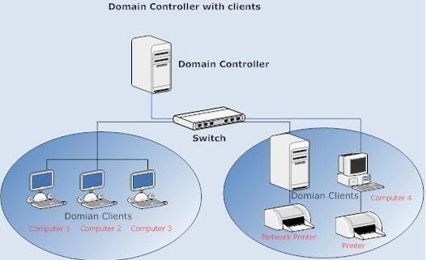

# Understanding Active Directory Infrastructure

**Microsoft Active Directory** plays a vital role in managing users, computers, and security within an organization’s network. It acts as a centralized directory that stores important information such as user accounts, group memberships, and security policies. For security professionals and penetration testers, understanding how this infrastructure works is essential for identifying weaknesses and potential attack paths.

An Active Directory environment is built from several core components, including **domains**, **domain controllers**, **forests**, and **trust relationships**. A **domain** is a logical structure that groups users, computers, and other resources under a shared security boundary. **Domain controllers** are servers responsible for running Active Directory services, authenticating users, and applying security policies across the domain.

Multiple domains can be combined into a **forest**, which represents the highest level of the Active Directory hierarchy and shares a common schema and configuration. Within and between these domains, **trust relationships** allow users from one domain to access resources in another, enabling collaboration across different parts of an organization’s network.

Active Directory also includes:

* A set of rules, **the schema**, that defines the classes of objects and attributes contained\
  in the directory, the constraints and limits on instances of these objects, and the\
  format of their names.
* A **global catalog** that contains information about every object in the directory. This\
  allows users and administrators to find directory information regardless of which\
  domain in the directory actually contains the data.
* A **query and index mechanism**, so that objects and their properties can be published\
  and found by network users or applications. For more information about querying\
  the directory.
* A **replication** service that distributes directory data across a network. All domain\
  controllers in a domain participate in replication and contain a complete copy of all\
  directory information for their domain. Any change to directory data is replicated to\
  all domain controllers in the domain.

#### Key Concepts

* **Domains, domain controllers, forests, and trust relationships** form the core structure of an Active Directory environment.
* **Domains** organize users, computers, and resources within a defined security boundary, while **domain controllers** handle authentication and policy enforcement.
* **Forests** connect multiple domains under a shared configuration, and **trust relationships** enable controlled access to resources between domains.
* An **Organizational Unit (OU)** in **Active Directory** is a container used to organize users, computers, groups, and other objects within a domain. It helps administrators manage resources more easily and apply **Group Policy** settings to specific groups of objects.

## Active Directory Domain Service (AD DS)

**Active Directory Domain Services** is the core component of **Active Directory** that provides **directory services for managing users, computers, and other resources in a network**. It works as a centralized system where all information about network "objects"—such as user, groups, computers, and security policies—is stored and organized in a directory database.

This service runs on **Windows Server** and allows administrators to control authentication and authorization across the network. When a user logs into a domain computer, AD DS verifies the user’s credentials and determines what resources they are allowed to access. It also enables administrators to manage permissions, apply group policies, and organize network objects in a structured hierarchy using domains, organizational units, and forests.

In **Active Directory**, **objects** are the **individual resources stored in the directory database**. Each object represents a network resource and contains attributes that describe it.

Examples of Active Directory objects include **users, computers, groups, printers, and shared folders**. These objects are used to manage identities, control access, and organize resources within a domain.

#### _Users_

Users are one of the most common object types in Active Directory. Users are one of the objects known as **security principals**, meaning that they can be authenticated by the domain and can be assigned privileges over **resources** like files or printers. You could say that a security principal is an object that can act upon resources in the network.

Users can be used to represent two types of entities:

* **People:** users will generally represent persons in your organisation that need to access the network, like employees.
* **Services:** you can also define users to be used by services like IIS or MSSQL. Every single service requires a user to run, but service users are different from regular users as they will only have the privileges needed to run their specific service.

#### _Machines / Computers_

Machines are another type of object within Active Directory; for every computer that joins the Active Directory domain, a machine object will be created. Machines are also considered "security principals" and are assigned an account just as any regular user. This account has somewhat limited rights within the domain itself.

The machine accounts themselves are local administrators on the assigned computer, they are generally not supposed to be accessed by anyone except the computer itself, but as with any other account, if you have the password, you can use it to log in.

> **Note:** Machine Account passwords are automatically rotated out and are generally comprised of 120 random characters.

Identifying machine accounts is relatively easy. They follow a specific naming scheme. The machine account name is the computer's name followed by a dollar sign. For example, a machine named `DC01` will have a machine account called `DC01$`.

#### _Security Groups_

If you are familiar with Windows, you probably know that you can define user groups to assign access rights to files or other resources to entire groups instead of single users. This allows for better manageability as you can add users to an existing group, and they will automatically inherit all of the group's privileges. Security groups are also considered security principals and, therefore, can have privileges over resources on the network.

Groups can have both users and machines as members. If needed, groups can include other groups as well.

Several groups are created by default in a domain that can be used to grant specific privileges to users. As an example, here are some of the most important groups in a domain:

| Security Group     | Description                                                                                                                                               |
| ------------------ | --------------------------------------------------------------------------------------------------------------------------------------------------------- |
| Domain Admins      | Users of this group have administrative privileges over the entire domain. By default, they can administer any computer on the domain, including the DCs. |
| Server Operators   | Users in this group can administer Domain Controllers. They cannot change any administrative group memberships.                                           |
| Backup Operators   | Users in this group are allowed to access any file, ignoring their permissions. They are used to perform backups of data on computers.                    |
| Account Operators  | Users in this group can create or modify other accounts in the domain.                                                                                    |
| Domain Users       | Includes all existing user accounts in the domain.                                                                                                        |
| Domain Computers   | Includes all existing computers in the domain.                                                                                                            |
| Domain Controllers | Includes all existing DCs on the domain.                                                                                                                  |

You can obtain the complete list of default security groups from the [Microsoft documentation](https://docs.microsoft.com/en-us/windows/security/identity-protection/access-control/active-directory-security-groups).

#### _Organizational Unit (OU)_

Organizational Units (OUs) provide a way to create administrative boundaries within a domain. Primarily, this allows you to delegate administrative tasks within the domain. OUs serve as containers into which the resources of a domain can be placed. You can then assign administrative permissions on the OU itself. We can even nest OUs (create OUs inside other OUs) for further control.

#### _Security Groups vs OUs_

You are probably wondering why we have both groups and OUs. While both are used to classify users and computers, their purposes are entirely different:

* OUs are handy for applying policies to users and computers, which include specific configurations that pertain to sets of users depending on their particular role in the enterprise. Remember, a user can only be a member of a single OU at a time, as it wouldn't make sense to try to apply two different sets of policies to a single user.
* Security Groups, on the other hand, are used to grant permissions over resources. For example, you will use groups if you want to allow some users to access a shared folder or network printer. A user can be a part of many groups, which is needed to grant access to multiple resources.

## Active Directory Structure&#x20;

Active Directory's main components, which we use to design the hierarchy and to optimize network traffic, are its logical structure and its physical structure. The logical structure, which simply organizes network resources, consists of OUs, domains, trees, and forests. The logical structure helps you design a network hierarchy that suits your organizational needs. We use the physical structure, which consists of sites and domain controllers, to manage and optimize network traffic by customizing the network configuration.

### Physical Structure of ADDS

The physical structure of Active Directory helps to manage the communication between servers with respect to the directory. The two physical elements of Active Directory are **domain controllers** and **sites**.

#### _Domain Controller (DC)_

A **Domain Controller** is a server that runs **Active Directory Domain Services** and is responsible for managing authentication, authorization, and directory data within a domain of **Active Directory**. It stores the Active Directory database and handles requests such as user logins, permission checks, and access to network resources. DC host other services that are complementary to AD DS as well. Those are:

* **Kerberos Key Distribution Center (KDC):** The KDC verifies and encrypts kerberos tickets that AD DS uses for authentication.
* **NetLogon:** NetLogon is the authentication communication service.
* **Windows Time (W32time):** Kerberos requires all computer times to be in sync.
* **Intersite Messaging (ISMServ):** Intersite messaging allows DCs to communicate with each other for replication and site-routing.

When a user attempts to log in to a domain computer, the Domain Controller verifies the username and password and determines whether the user is allowed to access the requested resources. It also enforces security policies and replicates directory information with other domain controllers to keep the directory consistent across the network.

<figure><figcaption></figcaption></figure>

#### _Sites_

In **Active Directory**, a **site** represents the **physical structure of a network**. It is used to group domain controllers and other network resources that are located in the same physical location or connected by a high-speed network.

A site is mainly created to manage **network traffic and replication between domain controllers**. When multiple offices exist in different geographic locations, administrators define sites so that **authentication requests and directory replication occur efficiently** within the same local network before communicating with remote locations. This helps reduce bandwidth usage across slower WAN links.

<figure><figcaption></figcaption></figure>

## Logical Structure of ADDS

The logical parts of Active Directory include Forests, Trees, Domains, OUs and Global Catalogs.

#### _Domain_

The basic organizational structure of the Windows Server OS networking model is the domain. A domain represents an administrative boundary. The computers, users, and other objects within a domain share a common security database.

#### _Tree_

Multiple domains are organized into a hierarchical structure called a tree. Actually, even if you have only one domain in your organization, you still have a tree. The first domain you create in a tree is called the root domain. The next domain that you add becomes a child domain of that root. This\
expandability of domains makes it possible to have many domains in a tree.

<figure><figcaption></figcaption></figure>

#### _Forest_

A forest is a group of one or more domain trees that do not form a contiguous namespace but may share a common schema and global catalog. There is always at least one forest on a network, and it is created when the first Active Directory-enabled computer (domain controller) on a network is installed. This first domain in a forest, called the forest root domain, is special because it holds the schema and controls domain naming for the entire forest. It cannot be removed from the forest without removing the entire forest itself. Also, no other domain can ever be created above the forest root domain in the forest domain hierarchy. A forest is the outermost boundary of Active Directory; the directory cannot be larger than the forest. The following figure shows an example of a forest with two trees. In this figure, Trees in a forest share the same schema, but not the same namespace.

<figure><figcaption></figcaption></figure>

#### _Group Policy Objects (GPO)_

In **Active Directory**, a **Group Policy Object (GPO)** is a collection of configuration settings used to control and manage the behavior of users and computers within a domain. It allows administrators to centrally define security settings, system configurations, and restrictions that automatically apply to users and machines in the network.

A GPO works through **Active Directory Domain Services** and is usually linked to a site, domain, or organizational unit. When a user logs into a computer that is part of the domain, the system retrieves the relevant GPO settings from the domain controller and applies them. These policies can control many things such as password policies, software installation, desktop restrictions, security configurations, and login scripts.

#### _GPO distribution_

GPOs are distributed to the network via a network share called `SYSVOL`, which is stored in the DC. All users in a domain should typically have access to this share over the network to sync their GPOs periodically. The SYSVOL share points by default to the `C:\Windows\SYSVOL\sysvol\` directory on each of the DCs in our network.

Once a change has been made to any GPOs, it might take up to 2 hours for computers to catch up. If you want to force any particular computer to sync its GPOs immediately, you can always run the following command on the desired computer:

```shell-session
PS C:\> gpupdate /force
```

## Authentication Methods

When using Windows domains, all credentials are stored in the Domain Controllers. Whenever a user tries to authenticate to a service using domain credentials, the service will need to ask the Domain Controller to verify if they are correct. Two protocols can be used for network authentication in windows domains:

* **Kerberos:** Used by any recent version of Windows. This is the default protocol in any recent domain.
* **NetNTLM:** Legacy authentication protocol kept for compatibility purposes.

While NetNTLM should be considered obsolete, most networks will have both protocols enabled. Let's take a deeper look at how each of these protocols works.

### Kerberos Authentication

Kerberos is the default protocol for authenticating service requests between trusted devices on a network. It’s been used since Windows 2000 and is a critical part of Windows Active Directory (AD) services and environments.

When a user logs into their PC, Kerberos is used to authenticate them via mutual authentication. Both the user and the server verify their identity. Kerberos is a stateless authentication protocol—it is based on tickets instead of transmitting user passwords over the network.

#### The three heads of kerberos authentication: KDC, Principle, & Resource

The three heads are represented in the Kerberos protocol by these three core components:

1. **Principal (Client):** A principal is simply an identity in Kerberos. It can be a User Principal, which is a normal user like user@DOMAIN, or a Service Principal, which represents a service like a web server (HTTP/server.domain@DOMAIN). In simple terms, a principal is anything that wants to prove its identity to access something in the network.
2. Resource: **A resource is the thing the user or service wants to access after authentication. This** can be a file server, website, database, or any network service. Kerberos makes sure only authenticated principals can access these resources.
3. **KDC (Key Distribution Center):** The KDC is the central system that handles authentication and gives out tickets. It checks identities and allows access by issuing secure tickets. It works inside a realm, which is just a group of users, services, and systems under the same authentication system (similar to a domain in Active Directory).

#### Key Distribution Center

The Key Distribution Center (KDC) also has more components for security. We can separate these into several parts:

1. **Kerberos database:** This stores the necessary authentication information regarding the principal and the systems and services they can authenticate to.
2. **Kerberos Authentication Server (AS):** Principals use this Kerberos service to authenticate themselves to get a ticket-granting ticket (TGT), also known as an authentication ticket (more on tickets coming up next).
3. **Kerberos Ticket Granting Service (TGS):** This Kerberos service accepts the TGT so that clients can access their application servers.

#### Kerberos tickets

The concept of tickets is crucial for Kerberos. This is where the magic happens. It’s the core feature of Kerberos that keeps passwords from being transmitted in clear text and allows for a single log-on to access multiple services and hosts.

Tickets leverage asymmetric encryption. They contain two encryption keys:

* **The ticket key:** Shared between the Kerberos infrastructure and the service requested by the principal.
* **The session key:** Shared between the principal and the service requested. Used to encrypt and decrypt communication with the service.

### Kerberos network authentication process explained

<figure><figcaption></figcaption></figure>

#### Step 1 — User Login → Request to KDC (AS)

The user logs into a system using a username and password. The client (user machine) sends a request to the Key Distribution Center (KDC), specifically to the Authentication Server (AS) part. This request contains the username and a timestamp encrypted using a key derived from the user’s password. This proves the user knows the correct password without sending it directly.

#### Step 2 — KDC (AS) → Sends TGT (Response)

The KDC checks the user details in Active Directory. If valid, it sends back a Ticket Granting Ticket (TGT) along with a Session Key.\
The TGT is encrypted using the krbtgt account hash, so the user cannot read or modify it.\
The Session Key is used for future communication.\
Now the user is authenticated and does not need to send the password again.

#### Step 3 — Client → Request TGS (Service Access Request)

When the user wants to access a service (like a file share or website), the client sends a request to the Ticket Granting Server (TGS) inside the KDC.\
This request includes:

* The TGT (proof of authentication)
* A new timestamp encrypted using the Session Key
* The Service Principal Name (SPN) (which tells which service the user wants to access)

#### Step 4 — KDC (TGS) → Sends Service Ticket (Response)

The KDC verifies the TGT and the request. If everything is valid, it sends back:

* A Service Ticket (TGS)
* A Service Session Key

The Service Ticket is encrypted using the service account’s password hash, so only that service can decrypt it. This ticket allows access only to that specific service.

#### Step 5 — Client → Sends Service Ticket to Server (Request)

Now the client sends the Service Ticket to the target server (for example, file server or web server), along with another authenticator (timestamp encrypted with the Service Session Key).

This proves:

* The user is authenticated
* The request is fresh (not replayed)

#### Step 6 — Server → Grants Access (Response)

The server decrypts the Service Ticket using its own password hash and verifies the Service Session Key.

If everything is correct:

* The server trusts the user
* Access is granted

Now the user can use the service without entering credentials again.

### NetNTLM Authentication

NetNTLM works using a challenge-response mechanism. The entire process is as follows:

<figure><figcaption></figcaption></figure>

1. The server generates a random number and sends it as a challenge to the client.
2. The client combines their NTLM password hash with the challenge (and other known data) to generate a response to the challenge and sends it back to the server for verification.
3. The server forwards the challenge and the response to the Domain Controller for verification.
4. The domain controller uses the challenge to recalculate the response and compares it to the original response sent by the client. If they both match, the client is authenticated; otherwise, access is denied. The authentication result is sent back to the server.
5. The server forwards the authentication result to the client.

Note that the user's password (or hash) is never transmitted through the network for security.

**Note:** The described process applies when using a domain account. If a local account is used, the server can verify the response to the challenge itself without requiring interaction with the domain controller since it has the password hash stored locally on its SAM.
