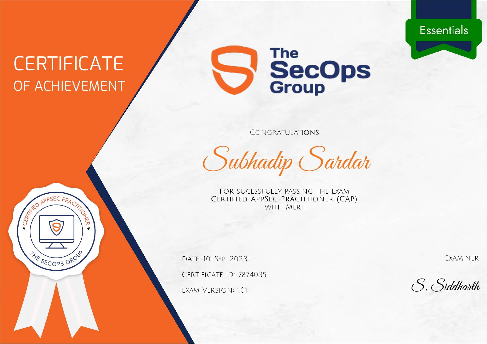
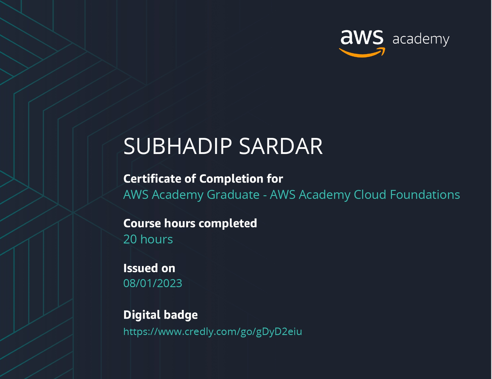

# WHOAMI

## Welcome to My ️GitBook

_**Greetings, and thank you for visiting!**_

Hello, I’m **Subhadip Sardar** — a cybersecurity professional with over 4 years of hands-on experience in **Networking, Windows/Linux Administration, Ethical Hacking, VAPT, and Cybersecurity Engineering**. My journey is fueled by a passion for problem-solving and a constant drive to stay ahead in the ever-changing cybersecurity landscape.

I hold a **B.Sc. (Hons.) in Advanced Networking & Cybersecurity from Brainware University**, where I built a strong foundation in both theory and practice. Along the way, I’ve achieved milestones such as:

* 🥇 Winning **TechGenesis 2K23** and **TechFusion 2K24 CTF** competitions.
* 🌍 Ranking in the **top 1% on TryHackMe** globally.
* 🛠️ Building **WebRecon**, a Python-based web enumeration tool for security assessments.

Currently, I am preparing for **CEHv13 (EC-Council)** and **CPTA (CyberWarfare Labs)** to further strengthen my expertise in penetration testing and advanced offensive security.

This GitBook is my **personal knowledge hub**, where I share:

* 🔐 Cybersecurity research & insights
* 🎯 CTF write-ups to guide fellow learners
* 📘 Technical notes & tutorials for enthusiasts and professionals

I believe knowledge grows when shared. Through this platform, my goal is to support the community, inspire learners, and help organizations strengthen their defenses against emerging threats.

Welcome aboard — let’s **learn, hack, and secure together.** 🚀

## CERTIFICATIONS



<figure><figcaption>
<a href="https://drive.google.com/file/d/1TzeEHRolxql62LTUGdhLjBl8gljtuAi7/view?usp=sharing">Certified Ethical Hacker (CEH) Practical</a>
</figcaption></figure>



<figure><figcaption>
<a href="https://drive.google.com/file/d/1OWIPkYVbI8HoRmUdrntcagR_mRTCUrF1/view?usp=sharing">CEH Certificate of Attendance</a>
</figcaption></figure>



<figure><figcaption>
<a href="https://drive.google.com/file/d/1Cz4wlzjMTkHPq95H9b1iVYdzxIwi7Pp7/view?usp=sharing">Certified AppSec Practitioner</a>
</figcaption></figure>



## OTHERS CERTIFICATIONS



<figure><figcaption>
<a href="https://drive.google.com/drive/folders/1_AEwWM-H_HYdk23KDFH-sjHaSzpuzm0B">Network Penetration Testing (Level-1)</a>
</figcaption></figure>



<figure><figcaption>
<a href="https://drive.google.com/drive/folders/1_AEwWM-H_HYdk23KDFH-sjHaSzpuzm0B">Network Penetration Testing (Level-2)</a>
</figcaption></figure>



<figure><figcaption>
<a href="https://drive.google.com/drive/folders/1_AEwWM-H_HYdk23KDFH-sjHaSzpuzm0B">Certification  in Ethical Hacking</a>
</figcaption></figure>



<figure><figcaption>
<a href="https://app.gitbook.com/u/ERlFATvz5aN1xj263d0Gr6mQHo42">AWS Academy Cloud Foundations</a>
</figcaption></figure>



## TryHackMe Learning Paths



<figure><figcaption>
<a href="https://tryhackme-certificates.s3-eu-west-1.amazonaws.com/THM-MRF7NLCAHU.pdf">Jr Penetration Tester</a>
</figcaption></figure>



<figure><figcaption>
<a href="https://tryhackme-certificates.s3-eu-west-1.amazonaws.com/THM-2AFIQD21FX.pdf">CompTIA Pentest+</a>
</figcaption></figure>



<figure><figcaption>
<a href="https://tryhackme-certificates.s3-eu-west-1.amazonaws.com/THM-VAVWVPEIIJ.pdf">SOC Level 1</a>
</figcaption></figure>



## ACHIEVEMENTS



<figure><figcaption>
<a href="https://drive.google.com/drive/folders/1_AEwWM-H_HYdk23KDFH-sjHaSzpuzm0B">Braincon CTF</a> 
</figcaption></figure>



<figure><figcaption>
<a href="https://tryhackme-certificates.s3-eu-west-1.amazonaws.com/THM-TESVEZZOEY.pdf">Advent of Cyber 2024</a>
</figcaption></figure>


